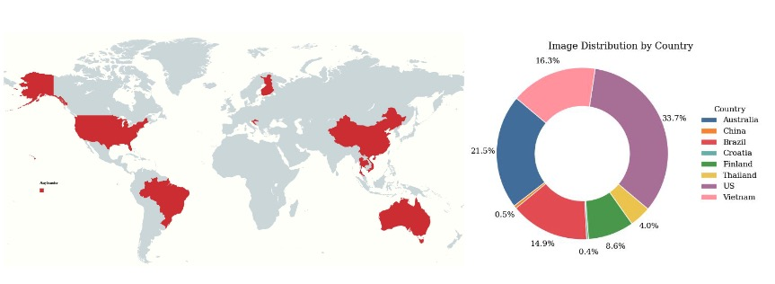
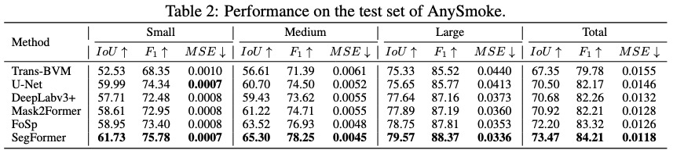
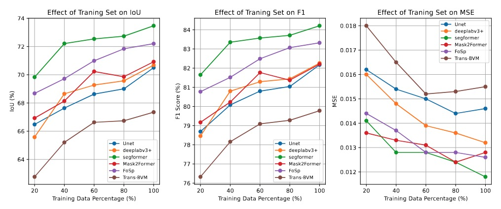

# AnySmoke: Segment Any Wildfire Smoke Dataset and Benchmark

---

## Overview


**AnySmoke** is the official implement for our paper _“AnySmoke: Segment Any Wildfire Smoke Dataset and Benchmark”_. It provides:

- A new wildfire smoke segmentation dataset, named **AnySmoke**, including smoke images around the world. 
- Evaluation scripts for state-of-the-art segmentation models on this dataset.
- Baseline results and benchmark metrics.

---

## Supported Models

We evaluate the following state-of-the-art segmentation models:

- **U-Net** (CNN-based)
- **DeepLabV3+** (CNN-based)
- **SegFormer** (transformer-based)
- **Mask2Former** (transformer-based)
- **FoSp** (domain-spefic)
- **Trans-BVM** (domain-spefic)

> The FoSp and Trans-BVM implementations follow their respective official repositories (see References below)
   * **FoSp**: follow instructions at [LujianYao/FoSp](https://github.com/LujianYao/FoSp)
   * **Trans-BVM**: follow instructions at [SiyuanYan1/Transmission-BVM](https://github.com/SiyuanYan1/Transmission-BVM)

---

## Usage

1. **Prepare the AnySmoke dataset**

   * Download AnySmoke Dataset at [AnySmoke](https://www.kaggle.com/datasets/zhaohongjin0615/anysmoke)

2. **Train a model**

   ```bash
   python model_name/train.py
   ```

  * Model performance will be evaluated used IoU, MSE, F1, Precision and Recall.

---


## Result

1. **Performance on state-of-the-art segmentation models**
  

2. **Performance across varying training data percentages**
  

## Announcement

We will soon refactor some of the code and release a more user-friendly version.

